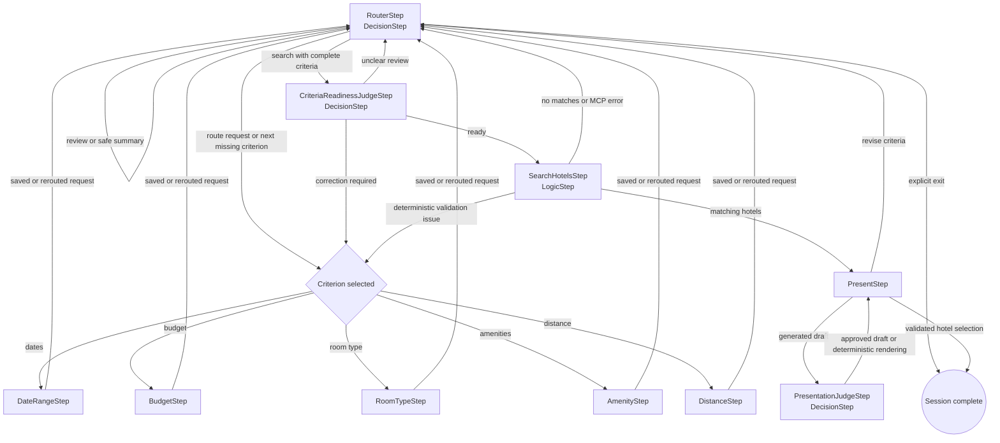

# DecisionHotelFlow

A focused Portland hotel-reservation demo showing `DecisionStep` in two roles: routing user requests and judging work before it reaches an external service or the user.

## Step interaction

Each criterion step owns its normalized state. If a user changes another criterion while one specialist is active, the shared `reroute_request` tool returns the original request to `RouterStep`, which sends it to the correct specialist in the same turn. The router can also review the current criteria, start a search, or finish an explicit exit request.

`RouterStep.defineQuestions()` builds its typed question map for every decision invocation. The router does not require dynamic definitions for correctness, but it demonstrates the capability by adding a question-specific instruction with the current unresolved criterion names; PicoFlow then prepends the shared `getPrompt()` guidance to both questions.

The readiness judge checks that the normalized snapshot still matches the conversation before the MCP-backed hotel search. Deterministic validation remains authoritative. The presentation judge releases a model draft only when its names, prices, and actions are grounded in the actual search results; otherwise the flow renders those results deterministically. Each `DecisionStep` also owns its provider-failure fallback: the router uses saved criteria, the readiness judge uses deterministic validation, and the presentation judge renders the saved hotel results. There is no `CompareStep`.

The flow uses the application’s existing `typesafe` decision provider, OpenAI model provider, session backend, and local hotel-pricing MCP client. Booking uses `finish(...)` to return the exact confirmation and complete the session without another model call. Start the demo normally and select `DecisionHotelFlow` through the existing flow endpoint.

## Live-test conversation

The following conversation was captured from a complete successful run of `npm run test:decision-hotel-flow` using the live OpenAI and Jev providers. Model wording and the generated confirmation number can vary between runs.

**User:** Hi

**Bot:** Please provide the check-in and checkout dates for your stay in Portland.

**User:** February 30, 2027 through March 5, 2027

**Bot:** February 30, 2027 is not a valid date. Could you please provide valid check-in and checkout dates for your stay in Portland?

**User:** August 1 through August 8, 2027

**Bot:** Please provide your budget range for the hotel per night. Is there a minimum or maximum amount you're willing to spend?

**User:** minimum 800 and maximum 500 per night

**Bot:** Could you please clarify your budget range? It seems the minimum is higher than the maximum.

**User:** maximum 700 per night, with no minimum

**Bot:** Could you specify the type of room you're interested in: one bed, two beds, or suite?

**User:** a suite

**Bot:** Which hotel amenities do you require? For example, free WiFi, free parking, breakfast, a pool, or a fitness center.

**User:** Actually change my dates to August 3 through August 9, 2027

**Bot:** Which hotel amenities do you require? For example, free WiFi, free parking, breakfast, a pool, or a fitness center.

**User:** free wifi and free parking

**Bot:** What is the maximum distance in miles you would prefer from the Portland airport and the Portland city center for your hotel? If distance doesn't matter, just let me know!

**User:** distance does not matter

**Bot:** Current Portland hotel criteria:

- Dates: 2027-08-03 to 2027-08-09
- Nightly budget: no minimum to $700
- Room type: suite
- Amenities: freeWiFi, freeParking
- Distance: no preference

Say “search” to find hotels, or tell me which criterion to revise.

**User:** show my criteria

**Bot:** Current Portland hotel criteria:

- Dates: 2027-08-03 to 2027-08-09
- Nightly budget: no minimum to $700
- Room type: suite
- Amenities: freeWiFi, freeParking
- Distance: no preference

Tell me what to revise, or say “search” when ready.

**User:** search

**Bot:** Here are the available hotels with their total prices in U.S. dollars:

1. **Hampton Inn & Suites Portland Tigard** - Total: $3810.60
2. **Hilton Garden Inn Portland Airport** - Total: $4204.80
3. **Hilton Garden Inn Beaverton** - Total: $3350.70
4. **Hampton Inn Sherwood Portland** - Total: $3547.80

You may book a hotel by its name or number, or you can revise your search criteria such as dates, budget, room type, amenities, or distance. Let me know how you would like to proceed!

**User:** change maximum budget to 500 per night

**Bot:** Current Portland hotel criteria:

- Dates: 2027-08-03 to 2027-08-09
- Nightly budget: no minimum to $500
- Room type: suite
- Amenities: freeWiFi, freeParking
- Distance: no preference

Say “search” to find hotels, or tell me which criterion to revise.

**User:** search

**Bot:** No hotels matched all current criteria. Tell me whether to revise budget, room type, amenities, or distance.

**User:** change maximum budget to 750 per night

**Bot:** Current Portland hotel criteria:

- Dates: 2027-08-03 to 2027-08-09
- Nightly budget: no minimum to $750
- Room type: suite
- Amenities: freeWiFi, freeParking
- Distance: no preference

Say “search” to find hotels, or tell me which criterion to revise.

**User:** search

**Bot:** Here are the matching hotels available for booking:

1. **Hampton Inn & Suites Portland Tigard** - Total: $3,810.60
2. **Hilton Garden Inn Portland Airport** - Total: $4,204.80
3. **Hilton Garden Inn Beaverton** - Total: $3,350.70
4. **Hampton Inn Sherwood Portland** - Total: $3,547.80

You may book a hotel by its name or number. Alternatively, you can revise your search criteria by adjusting the dates, budget, room type, amenities, or distance.

**User:** book hotel 1

**Bot:** Hampton Inn & Suites Portland Tigard is booked with confirmation #766201. Thank you for choosing Hilton.

Run `npm run test:decision-hotel-flow:contract` for the deterministic twenty-two-turn adapter test covering invalid inputs, a cross-step correction, readiness rejection, presentation rejection, empty results, simulated provider outages in all three DecisionSteps, criteria revision, grounded presentation, and booking. The contract test does not establish live provider reliability.
