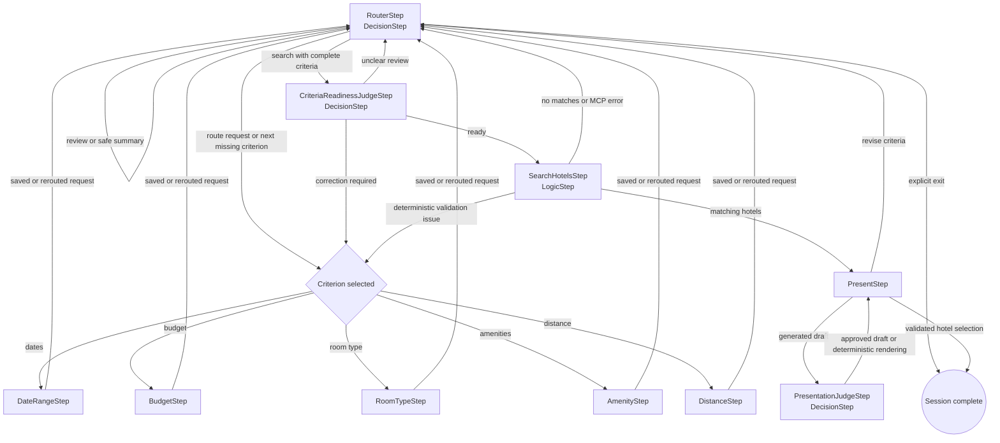

# DecisionHotelFlow

A focused Portland hotel-reservation demo showing `DecisionStep` in two roles: routing user requests and judging work before it reaches an external service or the user.

## Step interaction

Each criterion step owns its normalized state. If a user changes another criterion while one specialist is active, the shared `reroute_request` tool returns the original request to `RouterStep`, which sends it to the correct specialist in the same turn. The router can also review the current criteria, start a search, or finish an explicit exit request.

The readiness judge checks that the normalized snapshot still matches the conversation before the MCP-backed hotel search. Deterministic validation remains authoritative. The presentation judge releases a model draft only when its names, prices, and actions are grounded in the actual search results; otherwise the flow renders those results deterministically. Each `DecisionStep` also owns its provider-failure fallback: the router uses saved criteria, the readiness judge uses deterministic validation, and the presentation judge renders the saved hotel results. There is no `CompareStep`.

The flow uses the application’s existing `typesafe` decision provider, OpenAI model provider, session backend, and local hotel-pricing MCP client. Booking uses `finish(...)` to return the exact confirmation and complete the session without another model call. Start the demo normally and select `DecisionHotelFlow` through the existing flow endpoint.

Run `npm run test:decision-hotel-flow` for the credential-gated live Nest HTTP replay. It prints every labeled input, response preview, semantic-judge result, and final-state check while exercising real OpenAI and Jev providers. It requires `TYPESAFE_API_KEY`, `OPENAI_API_KEY`, and `PICOFLOW_KEY`, preserves the configured session store, and writes a successful transcript only after all assertions pass. Set `DECISION_HOTEL_FLOW_TEST_LOG=0` to suppress progress output.

Run `npm run test:decision-hotel-flow:contract` for the deterministic twenty-two-turn adapter test covering invalid inputs, a cross-step correction, readiness rejection, presentation rejection, empty results, simulated provider outages in all three DecisionSteps, criteria revision, grounded presentation, and booking. The contract test does not establish live provider reliability.
